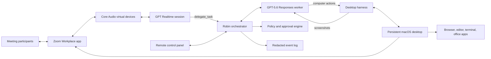
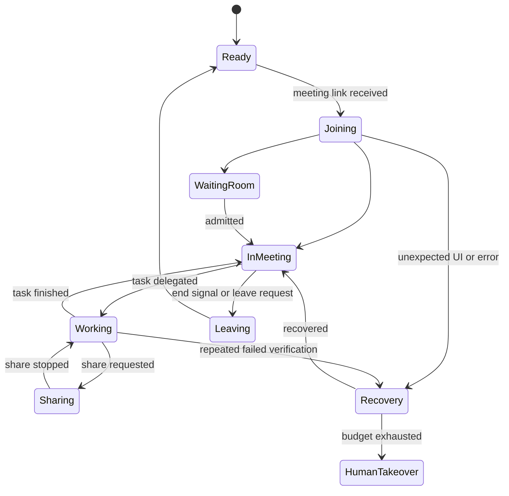

# Robin: a Mac-hosted agentic Zoom coworker

Status: implemented production candidate; real-Zoom release acceptance remains to be recorded
Primary target: dedicated Apple-silicon macOS host with a persistent logged-in desktop session  
Track: Work & Productivity

## 1. Product statement

Robin is a computer-use app with its own Zoom account. The normal Zoom Workplace desktop app is installed and signed in on that computer. GPT-5.6 sees and controls the whole desktop just as a remote human would: it opens Zoom, joins meetings, uses meeting controls, works in other applications, and shares its screen. GPT Realtime listens and talks through virtual audio devices connected to Zoom.

There is no Zoom SDK or hidden Zoom integration. Zoom is simply one of the GUI applications the agent operates.

The demo loop is:

1. A user sends Robin a meeting link through a small control panel or API.
2. Robin opens the normal Zoom app, joins from its signed-in account, and handles the waiting room.
3. Meeting audio flows to GPT Realtime; Robin's generated speech flows back into Zoom as its microphone.
4. A participant gives Robin a task by voice.
5. GPT-5.6 operates the Mac desktop to complete it.
6. Robin clicks Zoom's Share Screen controls and shares its work.
7. Robin reports the result verbally and retains a redacted action trace.

## 2. Core decisions

Build the orchestrator and control panel in TypeScript on Node.js. Add a small native Swift helper for ScreenCaptureKit capture, Accessibility/CGEvent input, window metadata, and macOS permission checks. This keeps product logic easy to develop while giving the computer harness reliable native access.

### Drive everything through the desktop

GPT-5.6 uses the Responses API computer-use loop against the Mac's display. The harness supplies screenshots and executes mouse, keyboard, scroll, and wait actions. It controls Zoom through the same interface as every other application.

Prefer semantic actions through the macOS Accessibility API when available, but keep screenshots and CGEvent input as the universal path. Do not call private Zoom APIs or rely on internal UI identifiers remaining stable.

### Split voice from deliberate action

- `gpt-realtime-2.1` owns continuous listening, speech, turn-taking, and interruption.
- `gpt-5.6` owns desktop observation, planning, computer actions, verification, and task state.
- A local orchestrator is the only component allowed to execute actions. Realtime delegates work through a narrow function interface and receives progress events to speak.

This lets Robin keep talking while a longer desktop task runs and prevents conversational output from directly bypassing safety checks.

## 3. Architecture



### One VM per Robin

Each Robin instance receives:

- one OS user and encrypted persistent disk;
- one Zoom account/profile;
- one persistent logged-in macOS desktop at a fixed resolution;
- dedicated Core Audio virtual input and output devices;
- one Robin daemon;
- a browser, editor, terminal, and any allow-listed work apps;
- network policy and encrypted secrets.

Do not run multiple agents in one desktop session. Horizontal scaling means provisioning another isolated VM.

## 4. Mac desktop and media plumbing

### Display

Keep a real persistent macOS WindowServer session alive independently of SSH. Use the provider's protected remote console, macOS Screen Sharing over a private network, or a hardened remote-desktop tool only for initial setup and human takeover. The model receives frames directly from ScreenCaptureKit, not from the remote desktop stream.

Use a fixed resolution and disable animations, notification popups, sleep, display scaling changes, and automatic window rearrangement. The Zoom window and work area start in deterministic positions.

### Audio graph

Create stable Core Audio routes with BlackHole 2ch (or a small project-owned Audio Server Plug-in after the MVP):

```text
Zoom speaker output -> robin-monitor -> Realtime input
Realtime audio output -> robin-mic -> Zoom microphone input
```

The human-debug speaker is a separate optional monitor and is disabled in production. The daemon performs:

- sample-rate and channel conversion;
- bounded jitter buffering;
- outbound-audio tagging and echo suppression;
- voice activity detection and barge-in;
- level metering and clipping detection;
- reconnects without changing Zoom's selected device names.

Audio MIDI Setup creates persistent aggregate/multi-output devices named `Robin Speaker` and `Robin Microphone`. The bootstrap/doctor tooling verifies their UIDs and routing. Zoom is configured once to use these devices, and the configuration persists in the host image.

### Screen sharing

Robin uses computer control to click Zoom's normal Share button, select the dedicated desktop or a work window, and confirm sharing. The agent verifies the green sharing indicator visually. It stops sharing through the Zoom UI.

The control panel and secrets must not appear on the shared desktop. Run the control panel outside the virtual desktop and keep secret material out of visible terminal commands.

## 5. Software components

### `robin-daemon`

A TypeScript/Node.js service managed by `launchd`. It owns lifecycle, OpenAI sessions, action execution, media routing, policy, logging, and health checks. A signed `RobinMacHelper` Swift executable provides native capture, input, window inspection, and permission status over a local Unix socket.

Implemented internal modules:

```text
apps/daemon/src/
├── orchestrator.ts     task and meeting lifecycle
├── realtime.ts         duplex audio and narrow function calls
├── worker.ts           GPT-5.6 Responses computer loop
├── desktop.ts          native and simulated desktop harnesses
├── audio.ts            bounded native audio subprocess bridge
├── policy.ts           allow list, blocked classes, and approvals
├── control.ts          authenticated loopback control API
├── audit.ts            minimized redacted JSONL traces
└── cli.ts              production readiness diagnostics
```

### Desktop harness

Expose a small typed interface:

```ts
interface DesktopHarness {
  screenshot(): Promise<CapturedFrame>;
  perform(actions: ComputerAction[]): Promise<ActionReceipt>;
  focusedWindow(): Promise<WindowInfo>;
  emergencyStop(): Promise<void>;
}
```

The first implementation calls the native Swift helper for ScreenCaptureKit frames, Accessibility actions, and CGEvent input. Keep it behind this interface so the helper can evolve without changing orchestration logic.

### Control panel

A small responsive web app provides:

- instance health and a live thumbnail;
- join-meeting form with link, display name, and optional task briefing;
- current task and spoken transcript;
- pause, resume, leave, mute, and human-takeover controls;
- point-of-risk approval cards;
- redacted action timeline;
- audio-device and OpenAI connection diagnostics.

The panel talks only to the daemon. It is never part of the model-controlled desktop.

## 6. Agent behavior

### Meeting lifecycle state machine



GPT-5.6 is given the goal, current lifecycle state, approval rules, recent screenshots, and a bounded action budget. It may handle ordinary Zoom dialogs—join audio, mute/unmute, waiting room, share selection, and leave confirmation—through computer use.

### Observe–act–verify loop

1. Capture a screenshot and focused-window metadata.
2. Ask GPT-5.6 for a small batch of actions.
3. Pass the batch through policy.
4. Execute allowed actions.
5. Capture another screenshot.
6. Verify the expected state transition.
7. Retry with fresh judgment or request human takeover after bounded failures.

Prefer keyboard shortcuts where stable, then accessibility-semantic controls, then coordinates. Never reuse coordinates without a fresh screenshot after a window transition.

### Realtime function surface

Realtime may call only:

- `delegate_task(goal, constraints, success_criteria)`
- `cancel_task(task_id)`
- `get_task_status(task_id)`
- `request_share(mode)`
- `stop_share()`
- `mute_self()` / `unmute_self()`
- `leave_meeting()`
- `request_approval(approval_id)`

It cannot issue raw clicks or keystrokes. The GPT-5.6 worker remains the single planner for desktop actions.

## 7. Identity, authority, and safety

### Who may command Robin

The control-panel owner is always authorized. For voice commands, the MVP uses one of these modes:

1. Owner-approved meeting: anyone in that meeting may suggest tasks, but external actions still require owner approval.
2. Named-controller mode: Robin accepts task delegation only after an owner selects or verbally designates the controller.

Zoom's mixed audio may not provide reliable speaker identity through a virtual speaker. Do not claim cryptographic voice identity. When authority matters, confirm through the control panel or a one-time spoken challenge shown only to the owner.

### Action policy

| Class | Examples | Default |
|---|---|---|
| Observe | inspect desktop, read a public page, summarize | allow and log |
| Reversible local | navigate, edit an unsent local draft | allow within task scope |
| Meeting control | join, mute, share approved workspace | allow if requested |
| External commitment | send, publish, submit, upload, invite | approve at action time |
| Sensitive | credentials, private files, permissions | owner approval or takeover |
| Destructive/financial | delete, purchase, transfer, security settings | blocked in MVP |

Treat web pages, meeting chat, shared screens, documents, and all other third-party content as untrusted. They are context, not authority. If the model sees instructions that resemble prompt injection or an unexpected security warning, it pauses and surfaces the screenshot to the owner.

### Emergency controls

- A control-panel stop button immediately releases all keys/buttons, cancels queued actions, mutes Robin, and stops screen sharing.
- A watchdog triggers the same stop if the daemon loses policy connectivity or exceeds an action rate.
- Remote-desktop human takeover suspends model input until explicitly released.
- Zoom credentials remain in the dedicated macOS user profile. OpenAI keys live in the macOS Keychain or the host provider's secret manager, never the repository or visible desktop.

## 8. Repository layout

```text
robin/
├── apps/
│   ├── daemon/            TypeScript orchestrator
│   ├── control-panel/     private static operator UI
│   └── mac-helper/        signed Swift package
├── packages/protocol/     shared action and event types
├── infra/launchd/         persistent user-service templates
├── scripts/               bootstrap, signing, Keychain, and diagnostics
├── fixtures/
│   ├── screenshots/       rendered fake-Zoom states
│   ├── meeting-audio/     mono PCM16 speech recordings
│   └── scenarios/         deterministic recovery cases
├── tests/                 unit, recovery, simulator, and E2E tests
├── docs/                  deployment, security, demo, and release records
├── Brewfile
└── package-lock.json
```

Zoom and BlackHole are not redistributed. Homebrew obtains their official packages, while `infra/versions.env` records the verified release baseline. The user signs into Zoom through the protected console. The committed simulator lets contributors exercise the agent without a Zoom account.

## 9. Reproduction path

Support two paths:

### Local development

```bash
git clone <repository-url>
cd robin
npm ci
npm run simulator
```

This runs the control panel, recorded audio fixtures, and a browser-based fake Zoom desktop for deterministic tests.

### Real VM deployment

```bash
./scripts/bootstrap-macos.sh
./scripts/keychain-secret.sh set OPENAI_API_KEY
./scripts/keychain-secret.sh generate ROBIN_PANEL_TOKEN
./scripts/install-launchd.sh
./scripts/doctor.sh
```

Then the operator opens the provider's protected remote console once, signs into the dedicated macOS account and Zoom, grants Screen Recording, Accessibility, Microphone, and Automation permissions, selects the persistent `Robin Microphone` and `Robin Speaker` devices, and runs the supplied verification meeting.

`doctor.sh` checks the WindowServer session, ScreenCaptureKit capture, all four helper permissions, Core Audio routes and capture levels, Zoom presence, credential presence without printing values, access to both configured OpenAI models, helper signing, launch services, and FileVault. The real acceptance checklist separately exercises actual UI input and Zoom behavior.

Pin the tested Mac model/provider, macOS release, Xcode/Swift version, Node version, Zoom package version, BlackHole version, display resolution, and Audio MIDI device configuration. Keep provisioning scripts public and provide a machine-readable `Brewfile`; secrets and the signed-in Zoom profile are intentionally excluded from the image.

## 10. Implemented release path

### Stage 0 — host validation

- Provision one dedicated Apple-silicon Mac host with a persistent logged-in desktop.
- Install the official Zoom client and sign in manually.
- Build the Swift helper and prove ScreenCaptureKit capture plus Accessibility/CGEvent input.
- Configure BlackHole/Core Audio virtual devices and prove a recorded WAV can be heard in a real Zoom meeting.
- Capture meeting audio back to a file.
- Prove Zoom screen sharing works on the virtual display.

Exit criterion: a human can remotely drive the Mac, join Zoom, hear both audio directions, and share the desktop. Do this before building product UI.

### Phase 1 — GPT-5.6 desktop worker

- Implement the screenshot/action Responses loop.
- Add task budgets, visual verification, deterministic window setup, and recovery.
- Teach the agent the common Zoom lifecycle through prompts and replay fixtures, not hardcoded coordinates.
- Add policy classification, emergency stop, and redacted event traces.

Exit criterion: GPT-5.6 joins a test meeting from a pasted link, mutes/unmutes, shares the correct desktop, and leaves without human clicks.

### Phase 2 — Realtime voice bridge

- Stream Core Audio meeting output into Realtime.
- Feed Realtime speech into the virtual Zoom microphone.
- Add barge-in, echo suppression, reconnects, and sparse worker progress messages.
- Implement the narrow delegation function surface.

Exit criterion: two humans can converse with Robin in Zoom, interrupt it, and delegate a bounded desktop task.

### Phase 3 — control panel and reliability

- Build join, task, approval, live state, emergency stop, and takeover UI.
- Add `launchd` supervision, health endpoints, metrics, and crash-safe task state.
- Add prompt-injection handling, action-rate limits, network restrictions, and secret redaction.
- Create macOS bootstrap, persistent launch services, and local simulator mode.

Exit criterion: another developer can deploy from the README and safely recover from Zoom dialogs, network loss, or a model timeout.

### Phase 4 — submission polish

- Choose one visually clear work task and rehearse it repeatedly.
- Finish public setup, security, troubleshooting, sample fixtures, and license.
- Record the under-three-minute video showing Zoom as an ordinary app, GPT-5.6 computer use, Realtime voice, screen sharing, approvals, and GitHub reproducibility.

Exit criterion: a clean VM passes `doctor.sh` and completes the golden demo three consecutive times.

## 11. Tests and demo benchmarks

Automate:

- Core Audio routing, resampling, echo-loop, clipping, and reconnect tests.
- Computer action schema and policy tests.
- Screenshot replay tests for Zoom join, waiting room, meeting, share chooser, share active, and leave states.
- Golden end-to-end tests against a fake Zoom UI.
- Secret-leak tests for logs, screenshots retained on disk, and control-panel events.
- Watchdog tests with stuck keys, lost OpenAI connection, and runaway action rate.

Manual release checks:

- Zoom account starts signed in after VM restart.
- Robin handles waiting room, host mute request, popup dialogs, and leave confirmation.
- It never shares the control panel, password manager, or secret-bearing terminal.
- Barge-in stops speech quickly and does not trigger on Robin's own voice.
- Emergency stop halts input, speech, and sharing even when the model request is in flight.
- A Zoom update cannot silently change the golden image before tests run.

Recommended demo: ask Robin in Zoom to research an allow-listed public topic, build a concise comparison in a local web app or document, share its screen while working, and present the result. Keep external submission out of the golden path; demonstrate the approval UI separately with an unsent action.

## 12. Principal risks

| Risk | Mitigation |
|---|---|
| Cloud Mac loses its logged-in GUI session | use a dedicated host, automatic user-session launch, watchdog checks, and provider console recovery |
| Zoom detects no shareable screen | persistent WindowServer session, fixed display, tested Zoom version, and provider display validation |
| Zoom UI changes | screenshot-based reasoning, visual state verification, pinned version, replay fixtures |
| Echo makes Robin talk to itself | separate virtual devices, outbound tagging, echo suppression, recorded loop tests |
| Mixed audio cannot prove speaker authority | control-panel authorization and one-time owner challenge |
| Full desktop access leaks data | disposable isolated VM, allow-listed apps/domains, no personal accounts, redacted traces |
| Automated Zoom-account use conflicts with account policy | review Zoom terms and account rules before public deployment; keep the prototype operator-supervised |
| CAPTCHA, MFA, or login expires | manual protected takeover; never automate CAPTCHA or persist visible credentials |
| Reproducibility depends on proprietary Zoom package | official installer script plus fake meeting mode and pinned environment documentation |

## 13. MVP cut line

Required:

- One reproducible dedicated macOS host running the ordinary Zoom desktop app.
- A signed-in dedicated Zoom account.
- GPT-5.6 can join, operate, share, and leave through computer use alone.
- GPT Realtime provides natural duplex voice with interruption.
- One reliable end-to-end coworker task.
- Control panel, approval gate, emergency stop, human takeover, and redacted trace.
- Public deployment scripts and a simulator that does not require Zoom.

Deferred:

- Multi-tenant hosted service and autoscaling.
- Simultaneous meetings or tasks.
- Perfect participant identification from mixed meeting audio.
- Autonomous calendar attendance without owner authorization.
- Purchases, destructive actions, credential entry, and unrestricted personal accounts.
- Windows and Linux hosts.

## 14. Immediate validation order

Before committing to the rest of the stack, test these in order:

1. Zoom launches and remains signed in on the chosen cloud Mac after reboot and GUI login.
2. The persistent WindowServer display supports both meeting video rendering and screen sharing when no remote viewer is connected.
3. Core Audio/BlackHole can capture Zoom's meeting output and inject audio as Zoom's microphone without feedback.
4. The Swift helper can capture Zoom screenshots and execute reliable input while no remote viewer is connected.
5. GPT-5.6 can navigate the real Zoom join/share/leave flow with bounded retries.

If any of the first three fail repeatedly, change the Mac hosting provider or display/audio configuration, not the agent architecture. The daemon, OpenAI sessions, policy, control panel, and desktop-harness interface remain unchanged.

## 15. Current source notes

- OpenAI recommends `gpt-5.6`/`gpt-5.6-sol` and the Responses API for reasoning, tool calling, and multi-turn workflows: <https://developers.openai.com/api/docs/guides/latest-model>
- Realtime supports speech-to-speech conversation and function calling: <https://developers.openai.com/api/docs/guides/realtime-conversations>
- OpenAI's computer-use guide supports screenshot/action and custom-harness patterns and recommends isolation plus point-of-risk confirmation: <https://developers.openai.com/api/docs/guides/tools-computer-use>
- Zoom distributes its normal Workplace desktop app for Apple silicon and Intel Macs: <https://support.zoom.com/hc/en/article?id=zm_kb&sysparm_article=KB0060928>
