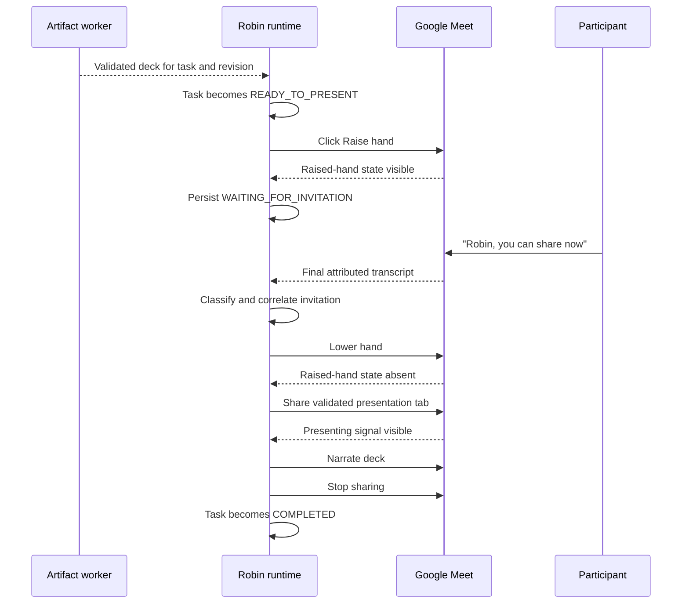

# Presentation Hand-Raise Handoff

**Status:** Proposed

**Owner:** Robin

**Last updated:** July 20, 2026

**Related documents:** `Robin_PRD.md`, `Robin_TDD.md`

## 1. Summary

When Robin finishes and validates a presentation, it should raise its hand in Google Meet instead
of waiting for an operator to click **Present**. Robin should remain silent and continue listening.
When a participant grants Robin the floor—for example, “Robin, I see your hand is raised. Could
you share?”—Robin should lower its hand, share the validated presentation, and narrate it using the
existing presentation flow.

The interaction is a two-step consent protocol:

1. Robin signals that a result is ready by raising its Meet hand.
2. A participant explicitly invites Robin to present.

Robin must never treat its own raised hand as permission to begin sharing.

## 2. Problem

Today, a validated task transitions to `READY_TO_PRESENT` and Robin says, “The analysis and slides
are ready.” An operator must then click **Present** in the dashboard. This breaks the illusion that
Robin is an independent meeting participant and introduces a hidden manual step into the primary
demo flow.

The desired behavior should use ordinary meeting etiquette and controls. Robin signals readiness
through Meet, waits for a participant to give it the floor, and then presents without operator
intervention.

## 3. Goals

- Remove the dashboard **Present** click from the normal presentation flow.
- Make readiness visible to every participant through Google Meet.
- Require a participant to grant the floor before Robin shares.
- Reuse the existing validated-artifact, screen-share, narration, and recovery paths.
- Keep the flow deterministic when multiple tasks finish close together.
- Preserve an operator fallback for recovery and rehearsals.

## 4. Non-goals

- Inferring permission from silence, topic changes, or a participant merely mentioning the deck.
- Allowing Robin to present an unvalidated or superseded artifact.
- Replacing Google Meet's native hand-raise UI with a custom dashboard signal.
- Supporting meeting platforms other than Google Meet in the first release.
- Removing the dashboard **Present** action; it remains a recovery control.
- Changing who has authority in the meeting. As in the current MVP, any participant may invite
  Robin to present.

## 5. Participant Experience

### 5.1 Happy path

1. A participant asks Robin to prepare an analysis and slides.
2. Robin acknowledges the task and completes it in the background.
3. The artifact passes validation and the task becomes `READY_TO_PRESENT`.
4. Robin raises its hand in Google Meet. It does not announce readiness aloud.
5. A participant says, “Robin, I see your hand is raised. Could you share?”
6. Robin recognizes this as an invitation to present the pending ready task.
7. Robin lowers its hand and says, “Sure—sharing now.”
8. Robin starts sharing the presentation tab, verifies that sharing began, narrates the deck, stops
   sharing, and returns to listening.

The short spoken acknowledgement in step 7 is optional if it would delay screen sharing by more
than one second. It must not be required for the state transition.

### 5.2 Accepted invitation language

The invitation should be recognized semantically, not from one exact phrase. Valid examples while
Robin has a pending hand raise include:

- “Robin, go ahead.”
- “Robin, you can share now.”
- “Robin, could you present what you found?”
- “Robin, let's see the deck.”
- “Robin, tell us what you found.”

An invitation is actionable only when all of the following are true:

- The turn addresses Robin by the configured wake word.
- Robin has a pending presentation request associated with a `READY_TO_PRESENT` task.
- The intent classifier identifies a clear grant of the floor or request to present.
- The transcript is not a suppressed echo of Robin's own speech.

These turns are not sufficient:

- “Robin has a deck ready.”
- “Did Robin raise its hand?”
- “We should look at Robin's slides later.”
- “Go ahead” without the wake word.

### 5.3 No invitation yet

Robin keeps its hand raised and continues listening and working. It does not repeat a spoken
readiness message. The dashboard shows which task is waiting for an invitation. The hand remains
raised until the task is invited, revised, cancelled, manually presented, or the meeting ends.

## 6. Product Decisions

### 6.1 One pending presentation at a time

Only one ready task owns Robin's raised hand. Ready tasks use first-ready, first-presented ordering.
If another task becomes ready while Robin's hand is already raised or Robin is presenting, it stays
in `READY_TO_PRESENT` and enters the presentation queue. After the active presentation completes,
Robin raises its hand for the next ready task.

Record `presentation_ready_at` the first time each revision reaches `READY_TO_PRESENT`; use that
timestamp rather than the task's mutable `updated_at` value for queue ordering. A new revision gets
a new readiness timestamp.

This prevents an ambiguous “go ahead” from selecting the wrong deck and prevents later tasks from
starving earlier ones.

### 6.2 Readiness and permission are separate

`READY_TO_PRESENT` means the artifact is valid. A raised hand means Robin has requested the floor.
Neither state means permission has been granted. Permission exists only after a qualifying
participant turn is correlated with the pending task.

### 6.3 Revisions invalidate the handoff

If the pending task is modified, cancelled, or loses its validated status, Robin lowers its hand
and clears the pending request before doing more work. Once the revised artifact passes validation,
Robin may raise its hand again with the new revision.

### 6.4 Manual controls are fallback controls

The dashboard **Present** button may bypass the verbal invitation for operator recovery. It must use
the same presentation lock and clear any raised hand before sharing. The dashboard should label it
as a manual override so the normal autonomous path remains legible.

## 7. State Model

Add a presentation handoff state distinct from task and Meet presentation state:

```text
IDLE
  -> RAISING_HAND
  -> WAITING_FOR_INVITATION
  -> INVITATION_RECEIVED
  -> STARTING_PRESENTATION
  -> PRESENTING
  -> IDLE

RAISING_HAND | WAITING_FOR_INVITATION
  -> LOWERING_HAND
  -> IDLE

Any non-idle state
  -> BLOCKED
  -> IDLE or retry
```

Suggested persisted model:

```python
class PresentationHandoff(BaseModel):
    state: Literal[
        "IDLE",
        "RAISING_HAND",
        "WAITING_FOR_INVITATION",
        "INVITATION_RECEIVED",
        "LOWERING_HAND",
        "STARTING_PRESENTATION",
        "PRESENTING",
        "BLOCKED",
    ] = "IDLE"
    task_id: UUID | None = None
    task_revision: int | None = None
    hand_raised: bool = False
    invited_by: str | None = None
    invitation_segment_id: UUID | None = None
    updated_at: datetime = Field(default_factory=now_utc)
    error: str | None = None
```

Add `presentation_ready_at: datetime | None` to `RobinTask`, or persist an equivalent immutable
ready timestamp in the handoff queue. The timestamp is cleared when that task revision is revised,
cancelled, completed, or failed.

Invariant: at most one `PresentationHandoff` may be non-idle for a meeting.

The task remains `READY_TO_PRESENT` while Robin is waiting. It transitions to `PRESENTING` only
after invitation validation and immediately before the existing `present_task()` flow begins.

## 8. System Flow



## 9. Technical Design

### 9.1 Meet adapter

Extend the meeting adapter with idempotent hand controls:

```python
async def raise_hand(self) -> None: ...
async def lower_hand(self) -> None: ...
async def is_hand_raised(self) -> bool: ...
```

Add selector registry entries for:

- `raise_hand_button`
- `lower_hand_button`
- `hand_raised_signal`

The adapter must follow the existing browser action contract: target the explicit Meet page,
prefer accessible role/name selectors, retry bounded failures, capture recovery screenshots, and
verify the postcondition. `raise_hand()` and `lower_hand()` are idempotent: calling either method
when already in the requested state succeeds without toggling to the opposite state.

Google Meet may expose the hand control inside a reactions menu. The adapter should first use a
direct visible control; if absent, it should open the reactions menu and select the hand action.
Selectors remain centralized in `meeting/selectors.py`.

### 9.2 Runtime coordinator

Add a single presentation-handoff coordinator owned by `RobinRuntime`. It is responsible for:

- Selecting the next eligible ready task.
- Raising and lowering Robin's hand.
- Persisting every handoff transition.
- Correlating an invitation with the pending task and exact task revision.
- Serializing handoff transitions with an `asyncio.Lock`.
- Starting the existing `present_task(task_id)` method exactly once.
- Advancing the ready queue after presentation, cancellation, revision, or recoverable failure.

When `_execute_task()` marks a deck `READY_TO_PRESENT`, it should call a non-blocking
`request_presentation_floor(task.id, task.revision)` method instead of speaking “The analysis and
slides are ready.” The worker must not block on receiving an invitation.

Before presentation starts, the coordinator rechecks:

- Task status is `READY_TO_PRESENT`.
- Task revision matches the revision captured when the hand was raised.
- A renderable `deck_json` artifact exists for that revision.
- Robin is still in the meeting.
- No other presentation is active or starting.

If any check fails, Robin lowers its hand, records why the invitation was rejected, and does not
share.

### 9.3 Intent classification

Add `presentation_invitation` to `MeetingIntent.classification`. The classifier receives a compact
`pending_presentation` object containing task ID, title, revision, and handoff state.

The local classifier should recognize direct, high-precision combinations of:

- The Robin wake word.
- Present/share/floor language such as `share`, `present`, `show us`, `go ahead`, or `your hand`.
- A pending `WAITING_FOR_INVITATION` handoff.

The model classifier handles semantic variants. The runtime should check for presentation
invitations before duplicate-task handling so “Robin, show us the deck” does not create a new task
or produce “I already have ... ready.”

The classifier result should include `referenced_task_id` when it can resolve the pending task. A
presentation invitation never mutates task requirements.

### 9.4 Concurrency and deduplication

- A handoff lock protects selection, invitation acceptance, and presentation start.
- The first accepted invitation segment ID is stored before any browser action.
- Replayed or duplicate transcript segments with that ID are ignored.
- Once the state is `INVITATION_RECEIVED` or later, later invitations receive no second start.
- Manual presentation, verbal invitation, task cancellation, and task revision all acquire the
  same lock.
- A failure to lower the hand does not start a second presentation; see failure policy below.

### 9.5 Events and observability

Persist these events with task ID and revision when applicable:

- `presentation.handoff.queued`
- `meeting.hand.raise.started`
- `meeting.hand.raised`
- `meeting.hand.raise.failed`
- `presentation.invitation.detected`
- `presentation.invitation.rejected`
- `meeting.hand.lowered`
- `meeting.hand.lower.failed`
- `presentation.handoff.started`
- `presentation.handoff.cleared`

Invitation events should include the transcript segment ID and attributed participant name, but
not raw audio. Existing transcript redaction continues to apply.

### 9.6 Dashboard

Expose `presentation_handoff` in `RuntimeSnapshot`. The dashboard should show one of:

- **Hand raised — waiting to present _task title_**
- **Invitation received from _participant_**
- **Starting presentation**
- **Presentation handoff blocked — _reason_**

Rename the task action from **Present** to **Present now (override)** and keep it available for an
operator. Add **Lower hand** only when Robin is waiting, as a recovery action rather than part of
the happy path.

### 9.7 Configuration

Add presentation handoff settings with safe defaults:

```yaml
presentation:
  base_url: "http://127.0.0.1:3000/present"
  default_slide_count: 4
  hand_raise_handoff_enabled: true
  require_wake_word_for_invitation: true
```

The feature flag permits controlled rollout and simulator compatibility. When disabled, the
current `READY_TO_PRESENT` plus dashboard override behavior remains available.

## 10. Failure and Recovery Policy

| Failure | Required behavior |
|---|---|
| Raise-hand control unavailable | Keep task `READY_TO_PRESENT`, set handoff `BLOCKED`, surface the error, and retain manual override. Do not claim the hand is raised. |
| Raise-hand click has no visible confirmation | Retry using the existing bounded browser recovery path; if still unverified, block the handoff. |
| Task is revised or cancelled while waiting | Lower the hand, clear the pending revision, then process the revision or cancellation. |
| Meeting ends while waiting | Best-effort clear local hand state and leave the task `READY_TO_PRESENT` for later recovery. |
| Invitation is ambiguous | Do not present. Keep the hand raised. If the turn addressed Robin, ask a concise clarification. |
| Invitation arrives after the task changed | Reject the stale invitation, lower the hand if needed, and enqueue the current eligible revision. |
| Lower-hand action fails after invitation | Record the failure and proceed because participant permission is already persisted and hand state does not control sharing. After sharing starts, re-check the hand state and make one best-effort idempotent lower attempt. Never toggle blindly. |
| Share dialog or presentation verification fails | Use existing presentation recovery, leave the task `READY_TO_PRESENT` with outcome `BLOCKED`, and do not automatically re-raise until the failed attempt is cleared or retried. |
| Duplicate invitation arrives | Ignore it after the first segment is persisted; never call `present_task()` twice. |

## 11. Security and Consent

- Raising a hand signals intent; it does not grant Robin permission to share.
- A participant turn must address Robin unless configuration explicitly relaxes the wake-word rule.
- Only validated files already permitted by Robin's workspace policy may be presented.
- The task ID and revision shown must match the rendered presentation identity before sharing.
- Robin should not reveal a deck title aloud merely because its hand is raised; the Meet hand is the
  default readiness notification.
- Existing equal-participant authority remains unchanged. Host-only invitation is out of scope.

## 12. Testing Strategy

### 12.1 Unit tests

- Intent classifier accepts the valid invitation examples only when a handoff is pending.
- Intent classifier rejects mentions, questions about hand state, missing wake words, and Robin
  speech echoes.
- Queue selection is first-ready, first-presented.
- Revision mismatch rejects a stale invitation.
- Duplicate transcript segments cannot start duplicate presentations.
- Task revision and cancellation clear the pending handoff.

### 12.2 Meet adapter tests

- Direct raise-hand button succeeds and verifies the raised signal.
- Reactions-menu fallback succeeds.
- Already-raised and already-lowered calls are idempotent.
- Hidden duplicate controls are ignored.
- Selector failure records recovery evidence and does not claim success.

### 12.3 Runtime integration tests

- A validated task raises Robin's hand without a dashboard request.
- Robin does not call `start_presenting()` before an invitation.
- A valid invitation lowers the hand and invokes `present_task()` once.
- A non-invitation turn leaves the hand raised.
- A second ready task queues and raises the hand after the first presentation completes.
- Presentation failure leaves a truthful recoverable state.
- Leaving the meeting clears handoff state.

### 12.4 Real Meet smoke test

From a second participant account:

1. Assign Robin a task that produces slides.
2. Verify Robin's hand becomes visibly raised without operator input.
3. Wait 15 seconds and verify Robin does not present on its own.
4. Say, “Robin, I see your hand is raised. Could you share?”
5. Verify Robin lowers its hand, shares the correct task revision, narrates audibly, stops sharing,
   and returns to listening.
6. Confirm the dashboard was not used except to observe state.

## 13. Acceptance Criteria

The feature is complete when all of the following are true:

1. A newly validated presentation causes Robin to raise its hand automatically in a real Google
   Meet.
2. Robin does not announce readiness aloud or begin sharing before a qualifying invitation.
3. A qualifying invitation containing the Robin wake word starts the correct validated revision
   without an operator click.
4. Robin lowers its hand, verifies screen sharing, narrates, stops sharing, and resumes listening.
5. One invitation can start at most one presentation.
6. Multiple ready decks are presented in deterministic first-ready order.
7. Revisions and cancellations cannot cause a stale deck to be shared.
8. Every hand and invitation transition is visible in persisted events and the dashboard.
9. Failures retain a truthful `READY_TO_PRESENT` or `BLOCKED` state and a manual recovery path.
10. The real Meet smoke test passes twice consecutively from a second participant account.

## 14. Implementation Slices

1. **Meet hand control:** selectors, adapter methods, simulator behavior, recovery evidence, and
   adapter tests.
2. **Handoff state:** schema, persistence, runtime queue, locking, task lifecycle hooks, and events.
3. **Invitation intent:** classifier schema and prompt, high-precision local fallback, correlation,
   and deduplication tests.
4. **Autonomous presentation:** connect invitation acceptance to the existing presentation method,
   handle cleanup and queue advancement, and add runtime integration tests.
5. **Operator visibility:** dashboard state, override labeling, lower-hand recovery action, config,
   and documentation.
6. **Real Meet verification:** add a handoff smoke path and capture two consecutive rehearsal runs.

## 15. Expected Code Surfaces

- `apps/core/robin_core/schemas.py`: handoff state, task readiness timestamp, and invitation intent.
- `apps/core/robin_core/meeting/selectors.py`: raise/lower controls and raised-state signal.
- `apps/core/robin_core/meeting/adapters/google_meet.py`: idempotent hand operations.
- `apps/core/robin_core/intent.py`: local and model-backed invitation classification.
- `apps/core/robin_core/runtime.py`: coordinator, queue, locks, lifecycle hooks, and events.
- `apps/core/robin_core/config.py`: feature configuration.
- `apps/core/robin_core/main.py`: manual lower-hand recovery endpoint if the dashboard exposes it.
- `apps/web/lib/types.ts` and `apps/web/app/page.tsx`: handoff visibility and override controls.
- `apps/core/tests/test_google_meet_adapter.py`, `test_intent.py`, and `test_runtime.py`: automated
  coverage.
- `scripts/smoke_real_meet.py` or a focused smoke script: second-participant proof.

## 16. Open Question

Should Robin say “Sure—sharing now” after the invitation, or should it begin sharing silently? This
spec defaults to the short acknowledgement because it confirms that Robin heard the participant,
but treats it as optional so it cannot block or materially delay presentation startup.
