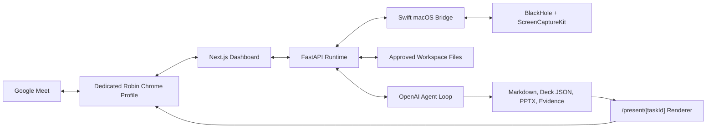

<div align="center">

# Robin

**A Mac-hosted AI coworker for live meetings.**

Robin can join Google Meet, listen for delegated work, inspect a bounded workspace,
generate sourced analysis artifacts, present findings back to the room, answer follow-up
questions, and leave with an audit trail.

[](https://www.python.org/)
[](https://fastapi.tiangolo.com/)
[](https://nextjs.org/)
[](https://swift.org/)
[](https://platform.openai.com/)

</div>

---

## Why Robin Exists

Robin is a prototype for a meeting-native AI teammate. It is designed for demos where an operator
can invite Robin into a Google Meet, ask it to analyze approved local files, watch it produce a
deck/report, and have it present the result in the meeting.

The project combines a local FastAPI runtime, a Next.js control dashboard, a Swift macOS bridge for
real audio/screen-capture work, and a bounded model tool loop for workspace-grounded analysis.



## What You Can Do

- Join or rehearse Google Meet workflows from a local dashboard.
- Listen for complete spoken turns containing the standalone wake word `Robin`.
- Run a bounded AI task loop over approved CSV, XLSX, PDF, Markdown, text, JSON, and PPTX files.
- Generate cited Markdown reports, browser-renderable decks, chart artifacts, and PPTX exports.
- Present generated decks back into Meet and narrate findings.
- Ask grounded follow-up questions or request spoken revisions.
- Capture traces, metrics, rehearsal evidence, and operator diagnostics.
- Exercise the system in simulator, local fixture, live model, and real Meet modes.

## Repository Layout

```text
.
├── apps/core/                  # FastAPI runtime, agent loop, audio/browser/calendar modules
├── apps/web/                   # Next.js dashboard and presentation renderer
├── apps/macos-bridge/          # Swift bridge for playback, capture, and macOS permissions
├── config/                     # Runtime configuration
├── scripts/                    # Setup, supervisor, smoke tests, evals, demo reset helpers
├── RobinWorkspace/             # Seeded source files, generated artifacts, sessions, traces
├── Robin_PRD.md                # Product requirements and demo definition of done
├── Robin_TDD.md                # Technical design details
├── Makefile                    # Primary command surface
└── pyproject.toml              # Python package/dependency metadata
```

## Requirements

Robin's full real-meeting path is macOS-specific. The core/dashboard and many tests can run anywhere
the toolchain is available, but real Google Meet audio and native share-picker automation need a
provisioned Mac.

| Area | Requirement |
| --- | --- |
| OS | macOS for real Meet/audio bridge workflows |
| Python | 3.12+ managed by `uv` |
| Node | 22+ with `pnpm` |
| Browser | Google Chrome 136+ recommended |
| Swift | Xcode Command Line Tools for `swift build` |
| Audio | BlackHole 2ch for real virtual microphone output |
| Media tooling | `ffmpeg` for real audio validation |
| AI | `OPENAI_API_KEY` for model-backed tasks, TTS, and transcription |
| Native UI automation | `cua-driver` with Accessibility and Screen Recording permissions for Chrome share picker automation |

## Quick Start

For a real Meet-ready setup on macOS:

```bash
scripts/setup_partner.sh --real-meet --no-start
make robin
```

Then open the dashboard, paste a Meet URL, and choose **Join & listen**.

- Dashboard: <http://127.0.0.1:3000>
- Core API docs: <http://127.0.0.1:8787/docs>
- Health endpoint: <http://127.0.0.1:8787/health>

`make robin` prepares a clean rehearsal, builds the macOS bridge if needed, builds the dashboard
runtime, launches Robin's dedicated Chrome profile, starts the core and web services, and opens the
dashboard. Keep the terminal open while Robin is running. Press `Control-C` to stop.

To preserve the previous rehearsal state:

```bash
scripts/run_robin.sh --keep-state
```

## Installation

### 1. Clone and Enter the Repo

```bash
git clone https://github.com/piercebrookins/robin.git
cd robin
```

### 2. Run the Setup Script

The setup script checks the local toolchain, creates `.env`, installs dependencies, builds the
Swift bridge, seeds `RobinWorkspace`, and can optionally start Robin.

```bash
scripts/setup_partner.sh --real-meet --no-start
```

Useful variants:

```bash
# Install and validate without starting services.
scripts/setup_partner.sh --no-start

# Faster install path when you do not want the full validation suite.
scripts/setup_partner.sh --skip-tests --no-start

# Real Meet path: switches config toward Chrome CDP + process audio bridge.
scripts/setup_partner.sh --real-meet
```

If `OPENAI_API_KEY` is not already exported, the script prompts for it and writes it to `.env`.

### 3. Verify the Environment

```bash
make doctor
make preflight
```

`make preflight` checks API keys, workspace data, database writes, disk headroom, dashboard
reachability, presentation URL configuration, browser mode, audio bridge mode, and real-machine
prerequisites when configured.

## Configuration

Robin reads `.env`, then loads the YAML file pointed at by `ROBIN_CONFIG_PATH`.

```bash
cp .env.example .env
```

Minimum `.env`:

```dotenv
OPENAI_API_KEY=sk-...
ROBIN_CONFIG_PATH=config/robin.example.yaml
GOOGLE_CLIENT_ID=
GOOGLE_CLIENT_SECRET=
```

Important config sections live in `config/robin.example.yaml`:

| Section | Purpose |
| --- | --- |
| `runtime` | Concurrency, acknowledgement timing, disk/RSS budgets, log level |
| `model` | Primary model, agent iteration limits, source-character budgets, intent thresholds |
| `audio` | OpenAI/simulator speech, bridge mode, capture window, realtime transcription, output device |
| `browser` | Meet base URL, Chrome CDP endpoint, profile path, timeouts, share dialog automation |
| `workspace` | Approved source/generated/session directories and allowed file types |
| `presentation` | Dashboard renderer base URL and default slide count |
| `database` | Local SQLite path |
| `calendar` | Local `.ics`/JSON calendar discovery and auto-join behavior |

### Local Simulator-Style Development

Use this path when you are working on the dashboard, API, workspace tools, or deterministic smokes
without joining a real Meet.

If your `config/robin.example.yaml` is currently configured for the real Meet path, switch these
values in a local config copy before starting:

```yaml
audio:
  mode: "simulator"
  bridge_mode: "simulator"
  bridge_executable: null

browser:
  automation_mode: "simulator"
  connection_mode: "launch"
  executable_path: null
  share_dialog_mode: "simulator"
```

```bash
scripts/setup_partner.sh --skip-tests --no-start
make seed
make dev
```

`make dev` starts the supervisor, which runs the core and web processes together and writes logs to
`RobinWorkspace/sessions/logs/`.

### Real Meet Mode

Real Meet mode expects:

- Google Chrome installed at `/Applications/Google Chrome.app/Contents/MacOS/Google Chrome`, or
  `ROBIN_CHROME_EXECUTABLE` pointing to another location.
- A dedicated Robin Chrome profile, launched with remote debugging enabled.
- BlackHole 2ch installed and available as the configured output device.
- The Swift bridge built at `apps/macos-bridge/.build/debug/robin-macos-bridge`.
- `cua-driver` available on `PATH` when native share-picker automation is required.
- macOS Accessibility, Screen Recording, and microphone permissions granted to the terminal/app
  running Robin and to CuaDriver.app where applicable.

Launch the dedicated Chrome profile:

```bash
make launch-chrome
```

Sign into Robin's Google account in that Chrome window once and leave it open. Chrome 136+ blocks
remote debugging against the normal/default profile, so Robin intentionally uses a separate profile
under `~/Library/Application Support/Robin/Chrome`.

Run a real Meet smoke:

```bash
ROBIN_REAL_MEET_URL=https://meet.google.com/... make smoke-real-meet
```

The smoke now verifies the presentation hand-raise handoff: Robin joins and listens, completes a
validated deck, raises its Meet hand, waits for the second participant to say the printed invitation
phrase, then shares and narrates without the dashboard **Present now (override)** action.

Run the operator-facing rehearsal:

```bash
make robin
```

## Running Robin

### Dashboard Flow

1. Start Robin with `make robin`.
2. Open <http://127.0.0.1:3000> if the browser did not open automatically.
3. Paste a Google Meet URL into the dashboard.
4. Select **Join & listen**.
5. Use **Test Robin voice** and **Test hearing (4 sec)** before the first real rehearsal.
6. Ask a complete delegated request containing `Robin`.
7. Wait for Robin's Meet hand to raise, then invite it to present from another participant account.
8. Watch task state, artifacts, transcript, health, and handoff status in the dashboard.
9. Let Robin leave normally or use the emergency stop if the rehearsal needs to halt.

Example prompt inside the meeting:

```text
Robin, use the finance files to compare the quarterly results and make slides.
```

### API Flow

Run the core directly:

```bash
make core
```

Run the web dashboard directly:

```bash
make web
```

The FastAPI docs are available at <http://127.0.0.1:8787/docs>.

## Command Reference

| Command | What it does |
| --- | --- |
| `make robin` | Clean real rehearsal startup: reset, build dashboard if needed, launch Chrome, start services |
| `make setup` | Run the setup script |
| `make seed` / `make seed-demo` | Seed the demo workspace |
| `make launch-chrome` | Open the dedicated Chrome profile with CDP debugging |
| `make dev` | Start supervised core + web services |
| `make doctor` | Print runtime health and preflight checks |
| `make preflight` | Alias for doctor/preflight readiness checks |
| `make core` | Run FastAPI on `127.0.0.1:8787` |
| `make web` | Run Next.js on `127.0.0.1:3000` |
| `make test` | Run Python tests and web tests |
| `make typecheck` | Run TypeScript type checking |
| `make eval-operator` | Run deterministic operator/build eval matrix |
| `make eval-operator-live` | Run live API model and realtime-audio checks |
| `make demo-reset` | Archive generated/session state, reseed fixtures, and restart supervisor |

## Smoke Tests

| Command | Coverage |
| --- | --- |
| `make smoke` / `make smoke-test` | End-to-end demo smoke |
| `make smoke-agent` | Live model workspace task flow |
| `make smoke-browser-operator` | Approval-gated semantic browser operator |
| `make smoke-memory` | Sourced meeting memory and correction flow |
| `make smoke-audio` | TTS and audio-file transcription smokes |
| `make smoke-audio-live` | OpenAI speech through BlackHole, Chrome capture, and transcription |
| `make smoke-audio-realtime` | Realtime transcription session |
| `make smoke-bridge` | Python-to-Swift bridge contract |
| `make smoke-capture` | ScreenCaptureKit capture against Chrome by default |
| `make smoke-listen` | Bounded listening loop |
| `make smoke-meet-fixture` | Local fake Meet fixture |
| `make smoke-meet-recovery` | Meet UI recovery and diagnostics |
| `make smoke-share-dialog-fixture` | Local hybrid share-dialog rehearsal |
| `make smoke-real-meet` | Full real Google Meet path using `ROBIN_REAL_MEET_URL` |
| `make smoke-calendar` | Local calendar discovery and auto-join logic |
| `make smoke-observability` | Events, metrics, traces |
| `make smoke-workspace` | Workspace boundary and source inspection |
| `make smoke-validation` | Artifact validation gates |
| `make smoke-clarification` | Ambiguous request clarification flow |
| `make smoke-queue` | Task queue behavior |
| `make smoke-dedup` | Duplicate request suppression |
| `make smoke-retry-present` | Presentation retry behavior |
| `make smoke-conversation-revision` | Grounded Q&A, revision, narration, cleanup |
| `make smoke-resource-budgets` | RSS and workspace disk budget enforcement |
| `make smoke-leave-cleanup` | Meeting leave cleanup |

When Chrome is not visible to ScreenCaptureKit, target a different bundle:

```bash
uv run python scripts/smoke_capture.py --bundle-id com.apple.Safari
```

## Artifacts and Evidence

Robin keeps operational state under `RobinWorkspace`:

```text
RobinWorkspace/
├── source-data/                 # Approved input files
├── generated/                   # Reports, decks, charts, PPTX exports, browser downloads
├── sessions/
│   ├── logs/                    # Supervisor child-process logs
│   ├── traces/                  # JSONL runtime traces
│   ├── evidence/                # Operator eval bundles
│   └── browser-recovery/        # Recovery screenshots and diagnostics
├── rehearsals/                  # Second-participant proof records
└── robin.db                     # Local SQLite runtime state
```

Runtime observability endpoints:

- `GET /api/events`
- `GET /api/metrics`
- `WS /ws/events`
- `GET /health`

## Safety Model

Robin is intentionally bounded for demos:

- Workspace tools can only read approved files under the configured workspace root.
- Generated files are restricted to safe document/data extensions and generated directories.
- Path traversal, source edits, executable writes, oversized content, and unapproved citations are
  rejected.
- The model browser operator requires approval for consequential actions and isolates downloads
  under `generated/browser-downloads`.
- Raw sound does not interrupt playback. Wake-word barge-in requires transcription to identify
  `Robin`.
- Robin ignores its own echoed speech when deciding whether to act.
- Emergency stop cancels task/speech/memory workers, stops capture and sharing, leaves Meet, and
  records cleanup errors.

## Native macOS Bridge

Build the bridge:

```bash
swift build --package-path apps/macos-bridge
```

Run its smoke:

```bash
make smoke-bridge
```

Use process bridge mode:

```yaml
audio:
  bridge_mode: "process"
  bridge_executable: "./apps/macos-bridge/.build/debug/robin-macos-bridge"
```

The bridge handles native playback routing, Chrome audio capture samples, ScreenCaptureKit app
listing, and permission checks. In real rehearsals, Robin should use:

```yaml
audio:
  mode: "openai"
  bridge_mode: "process"
  output_device_name: "BlackHole 2ch"
```

## Calendar Discovery

Robin can discover local calendar events with Meet links from `.ics` or JSON files.

```yaml
calendar:
  enabled: true
  provider: "local"
  file_path: "./RobinWorkspace/source-data/calendar_demo.ics"
  auto_join: true
  join_early_seconds: 60
```

Validate it with:

```bash
make smoke-calendar
```

## LaunchAgent

On a pre-provisioned Mac, install Robin as a user LaunchAgent:

```bash
scripts/install_launch_agent.sh
```

Remove it:

```bash
scripts/install_launch_agent.sh uninstall
```

## Troubleshooting

### `make robin` says real audio is not configured

Run:

```bash
scripts/setup_partner.sh --real-meet --no-start
```

Then confirm `.env` contains `OPENAI_API_KEY` and `ROBIN_CONFIG_PATH=config/robin.example.yaml`.

### Chrome opens but Robin cannot connect

Check that the dedicated debug endpoint is alive:

```bash
curl http://127.0.0.1:9222/json/version
```

If it is not, run:

```bash
make launch-chrome
```

Leave the dedicated Chrome window open while Robin is running.

### The meeting cannot hear Robin

Verify the audio path:

```bash
make smoke-audio-live
```

Confirm BlackHole 2ch is installed, selected by Robin, and visible in Google Meet microphone
settings. Robin disables Meet processing that can suppress virtual-mic audio, but the device still
has to be present.

### Screen sharing gets stuck at the native picker

Confirm `cua-driver` is on `PATH` and CuaDriver.app has Accessibility and Screen Recording
permissions. Then run:

```bash
make smoke-share-dialog-fixture
```

### The dashboard is blank or stale

Rebuild and restart:

```bash
pnpm --dir apps/web build
make dev
```

### A rehearsal needs a clean slate

```bash
make demo-reset
```

For a clean start through the main runner:

```bash
make robin
```

For restart without archiving current rehearsal state:

```bash
scripts/run_robin.sh --keep-state
```
